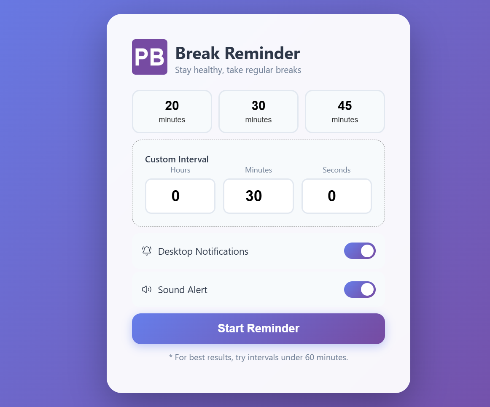

# Pulse Break

> A lightweight Windows desktop app that reminds you to take regular breaks, stretch, hydrate, and rest your eyes.



🌐 **Web version:** [pulsebreak.netlify.app](https://pulsebreak.netlify.app)

---

## Features

- ⏰ Set custom break intervals (20, 30, 45 minutes or custom)
- 🔔 Desktop notifications when it's time to break
- 🔊 Audio reminders with voice prompts
- 🖥️ Minimizes to the system tray — runs quietly in the background
- 🔇 Mute notifications directly from the system tray
- 🪶 Lightweight — built with Tauri (~5MB installer)

---

## Download & Install

1. Go to the [Releases](https://github.com/Donvine254/pulse-break/releases) page
2. Download the latest installer for your preference:
   - **`pulse-break_0.1.0_x64-setup.exe`** — NSIS installer (recommended)
   - **`pulse-break_0.1.0_x64_en-US.msi`** — MSI installer
3. Run the installer and follow the prompts
4. Pulse Break will launch and appear in your system tray

> **Note:** Windows may show a SmartScreen warning since the app is not yet code-signed. Click **"More info" → "Run anyway"** to proceed.

---

## Usage

1. Choose a break interval from the presets or set a custom one
2. Click **Start Reminder**
3. The app minimizes to the system tray and counts down
4. When your break is due, a notification and audio reminder will play
5. Right-click the tray icon to **Open**, **Mute Notifications**, or **Quit**

---

## Building from Source

### Prerequisites

- [Node.js](https://nodejs.org) (v18 or later)
- [Rust](https://rustup.rs) (latest stable)
- [Tauri CLI](https://tauri.app/start/prerequisites/)

### Steps

```bash
# 1. Clone the repository
git clone https://github.com/Donvine254/pulse-break.git
cd pulse-break

# 2. Install dependencies
npm install

# 3. Run in development mode
npm run tauri dev

# 4. Build the installer
npm run tauri build
```

The installer will be output to:

```
src-tauri/target/release/bundle/nsis/pulse-break_0.1.0_x64-setup.exe
src-tauri/target/release/bundle/msi/pulse-break_0.1.0_x64_en-US.msi

```

---

## Tech Stack

- **Frontend:** HTML, CSS, Vanilla JavaScript
- **Desktop:** [Tauri v2](https://tauri.app) (Rust)
- **Web version:** Deployed on [Netlify](https://netlify.com)

---

## Contributing

Pull requests are welcome! For major changes, please open an issue first to discuss what you'd like to change.

---

## License

[MIT](LICENSE)
